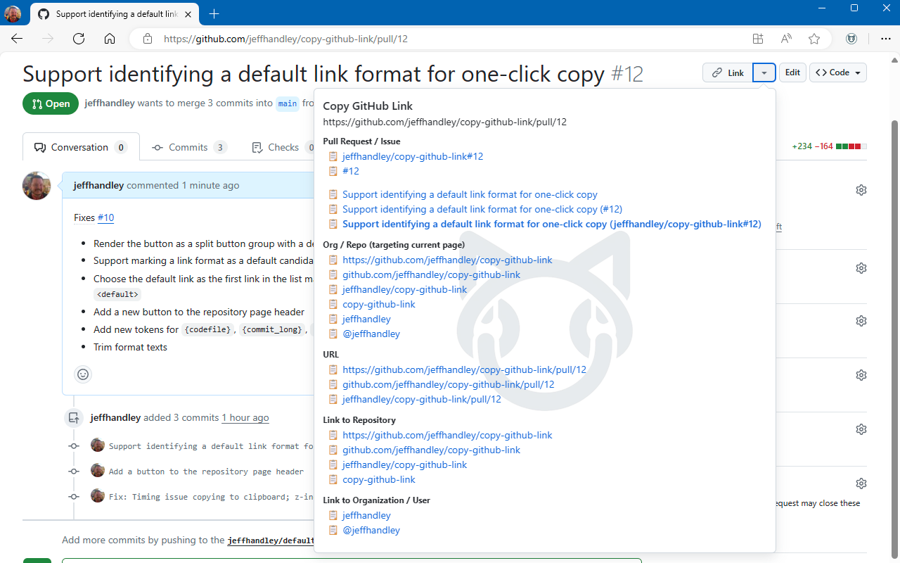
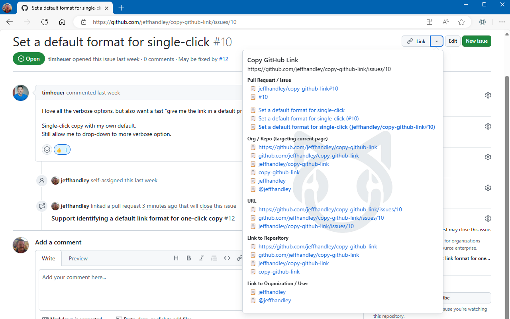
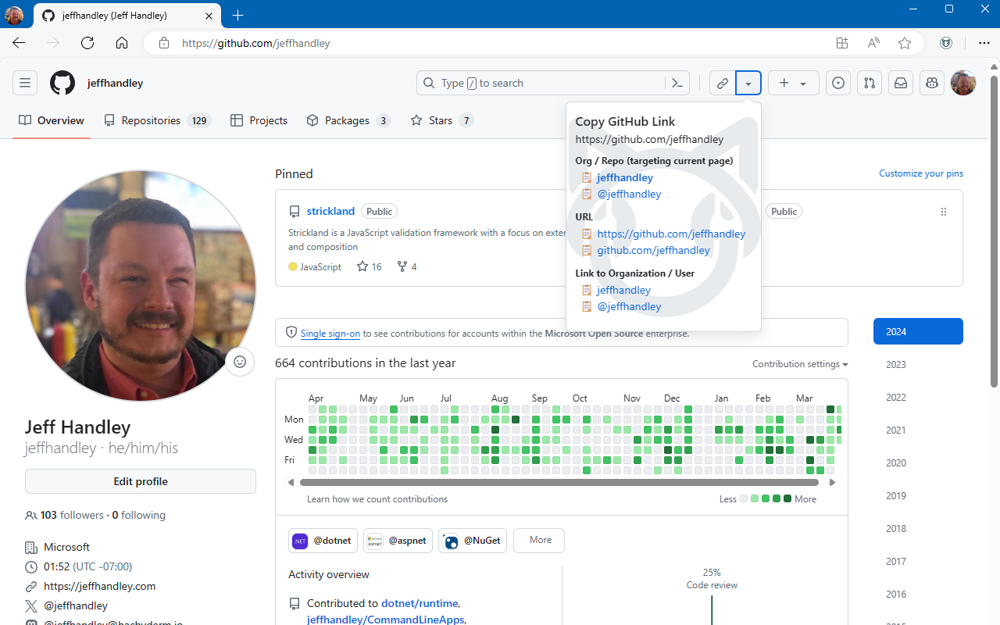

# Copy GitHub Link - Chromium Extension

Copy formatted GitHub links for issues, pull requests, and more.

The link you select is copied to the clipboard using the full URL of the current page, with the text copied available in many formats. Links are copied to the clipboard in both plain text format (just the text, without the URL) and as a hyperlink to the current page's full URL.

## Links Available Through the Extension Popup

Not all link formats are applicable for all GitHub URLs, so any format that is not applicable for the current page is omitted.

* When viewing an issues or a pull request
  * `{org}/{repo}#{number}`
  * `#{number}`
  * `{title}`
  * `{title} (#{number})`
  * `{title} ({org}/{repo}#{number})`
* For any GitHub URL within an org/repo
  * `https://github.com/{org}/{repo}`
  * `github.com/{org}/{repo}`
  * `{org}/{repo}`
  * `{repo}`
* For all GitHub URLs
  * `https://github.com/{pathname}#{hashname}`
  * `https://github.com/{pathname}`
  * `github.com/{pathname}#{hashname}`
  * `github.com/{pathname}`

Links to pull requests remove the " by {author} · Pull Request #{number} · {org}/{repo}" suffix from the title.

## Usage, Demo, and Screenshots

The extension enables itself on GitHub.com pages, and clicking the extension's icon in the toolbar opens the popup to copy a GitHub link. Clicking any of the links will copy that formatted link to the clipboard. When pasting from the clipboard, applications that accept rich text will paste the formatted link with the target URL pointing to the current page. Applications that receive only plain text will paste in the formatted text without it being a link. _Note that many applications support `Ctrl`+`Shift`+`V` (or `Cmd`+`Shift`+`V`) to paste as plain text._

## Acknowledgements

This extension was originally inspired by @zaki-yama, and their [zaki-yama/copy-title-and-url-as-markdown: Chrome Extension: Quickly copy the title & url of current tab as Markdown style](https://github.com/zaki-yama/copy-title-and-url-as-markdown). Fun note, that extension was used to copy that link as Markdown.

Additional acknowledgement to @timheuer for creating [timheuer/repolink](https://github.com/timheuer/repolink) when I asked if an extension like this existed. Tim's quick turnaround for creating that extension encouraged the development of this implementation.
