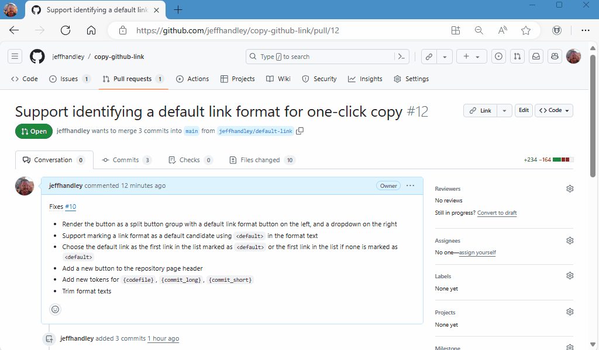
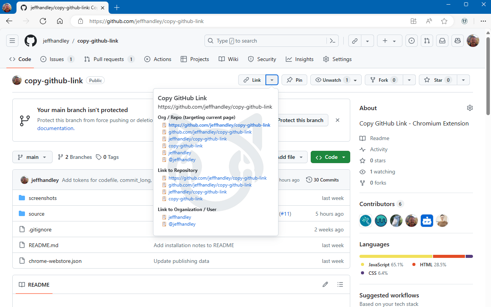

# Copy GitHub Link - Chromium Extension

Copy formatted GitHub links for issues, pull requests, repositories, users, and more.

Generates formatted GitHub links that can be copied to the clipboard from any github.com page. Using either the extension icon in the toolbar or one of the link dropdown buttons added to the github.com UI, a popup is shown with a list of convenient formats for the current page. Clicking any of the links will copy a link in that format to your clipboard. Links are copied in both plain text format (just the text, without the URL) and as a hyperlink to the current page's full URL for compatibility pasting into any application.

## Installation

This extension is published to the Chrome Web Store, which can be used for both Chrome and Edge.

* [Copy GitHub Link version 1.2.0](https://chromewebstore.google.com/detail/copy-github-link/dnfnnlockpehnpkfdbejdogbfkjfeaan)

The extension can also be installed locally by cloning this repository, turning on on Developer Mode in your browser's extension settings, and choosing to 'Load Unpacked' from the `source` folder.

## Fully Configurable with Useful Defaults

The link formats available are dynamic based on the context of the page, and they are also fully configurable. Links can be conditionally visible based on what data elements are available, even if those data elements are not used in the link text. Links can be organized into groups and both the text and URL of links can be customized from the extension options page.

The extension comes with over 40 default link formats available, including these useful examples:

* When viewing an issues or a pull request
  * `{org}/{repo}#{number}`
  * `#{number}`
  * `{title}`
  * `{title} (#{number})`
  * `{title} ({org}/{repo}#{number})`
* When viewing a code file or folder
  * `{repo}/{codebranch}/{codepath}`
  * `{repo}/{codepath} ({codebranch})`
  * `{repo}/{codepath}`
  * `{codepath} ({codebranch})`
  * `{codepath}`
* For any GitHub URL within an org/repo
  * `https://github.com/{org}/{repo}`
  * `github.com/{org}/{repo}`
  * `{org}/{repo}`
  * `{repo}`
  * `@{org}`

The `{title}` token removes the " by {author} · Pull Request #{number} · {org}/{repo}" suffix from GitHub's page title, and it also sanitizes the page title when viewing a code file or folder.

## Usage, Demo, and Screenshots

The extension enables itself on GitHub.com pages, and clicking the extension's icon in the toolbar opens the popup to copy a GitHub link. Clicking any of the links will copy that formatted link to the clipboard. When pasting from the clipboard, applications that accept rich text will paste the formatted link with the target URL pointing to the current page. Applications that receive only plain text will paste in the formatted text without it being a link. _Note that many applications support `Ctrl`+`Shift`+`V` (or `Cmd`+`Shift`+`V`) to paste as plain text._

## Acknowledgements

This extension was originally inspired by @zaki-yama, and their [zaki-yama/copy-title-and-url-as-markdown: Chrome Extension: Quickly copy the title & url of current tab as Markdown style](https://github.com/zaki-yama/copy-title-and-url-as-markdown). Fun note, that extension was used to copy that link as Markdown.

Additional acknowledgement to @timheuer for creating [timheuer/repolink](https://github.com/timheuer/repolink) when I asked if an extension like this existed. Tim's quick turnaround for creating that extension encouraged the development of this implementation.
